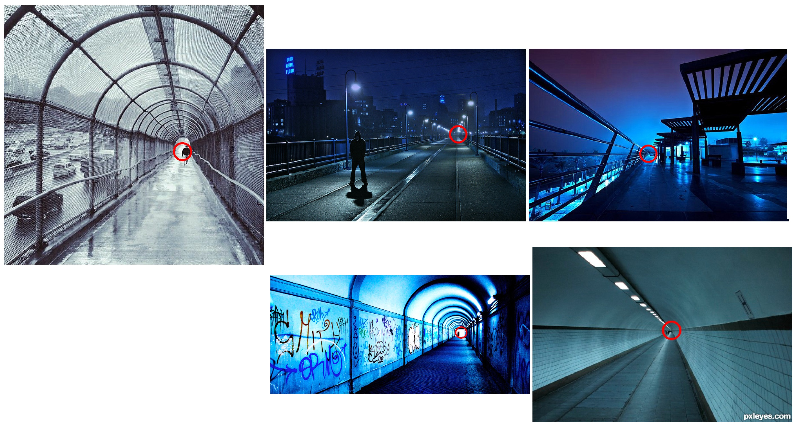

# Vanishing point
Finds the vanishing point using the following method (implemented using openCV):

1. Get edges (Canny)
2. Get lines (HoughTransform)
3. find intersections of lines
4. cluster intersections of lines
5. Find centroid of the largest cluster (This is the vanishing point)

Example Results

